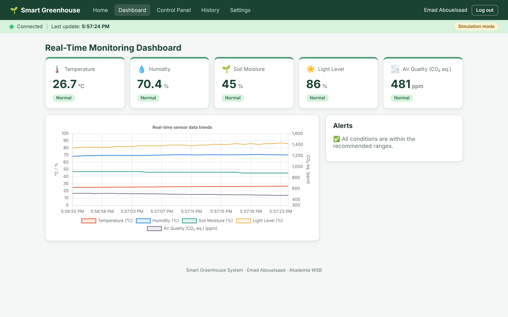
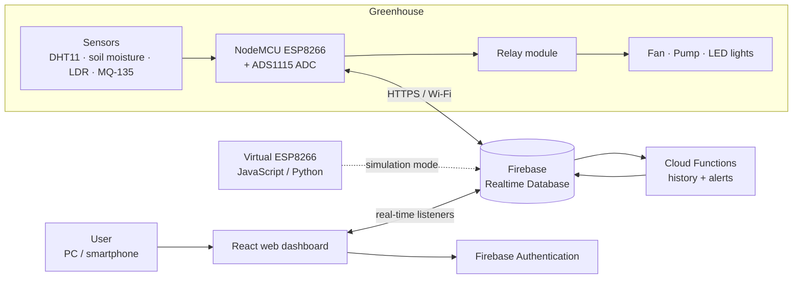
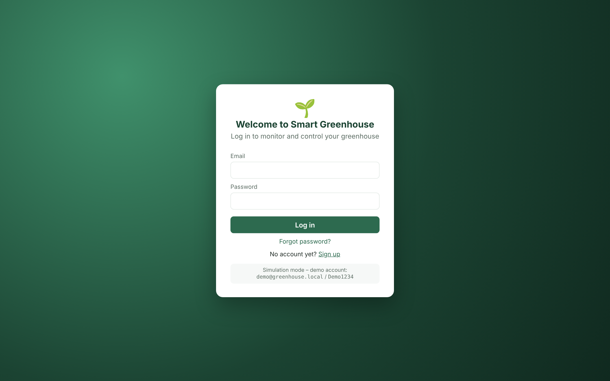
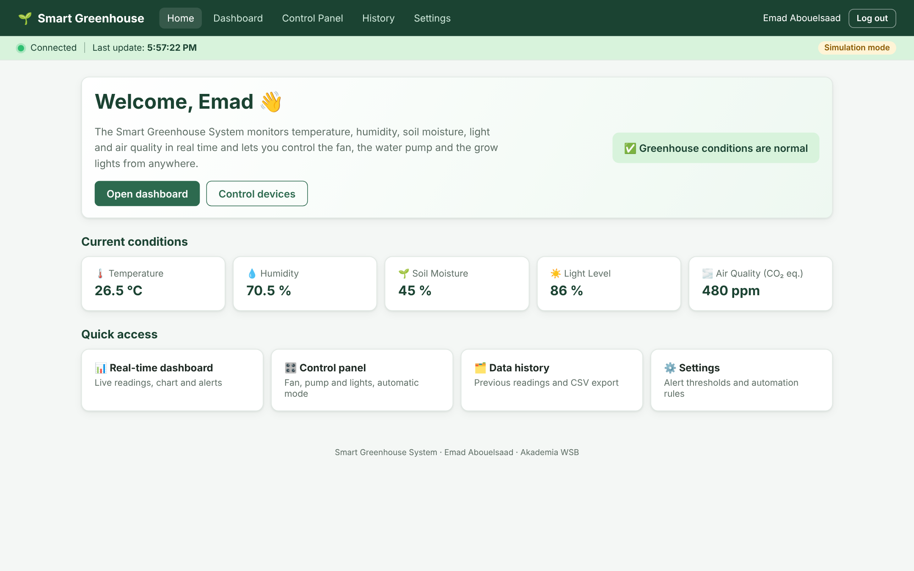
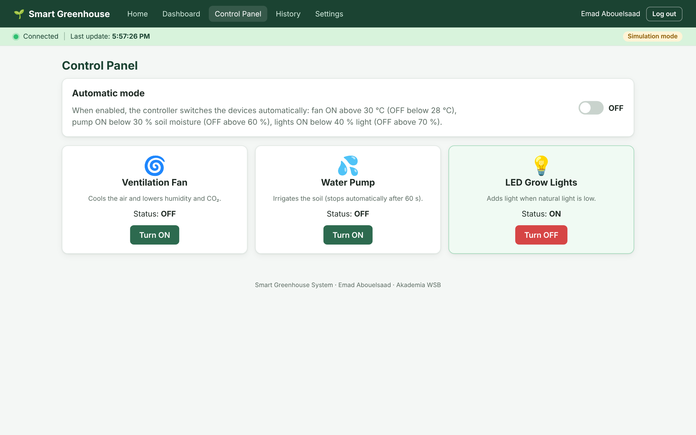
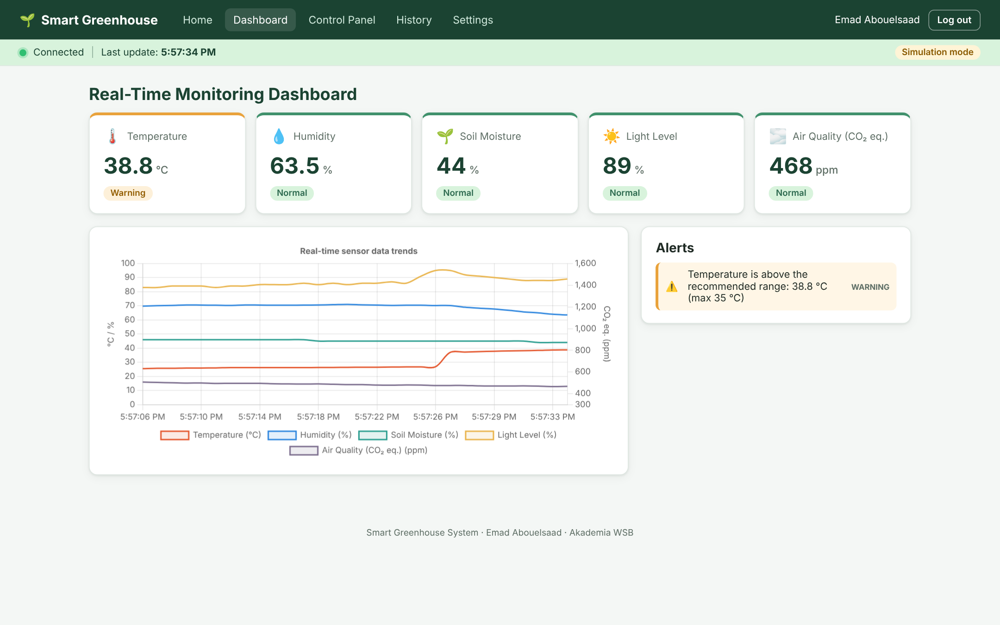
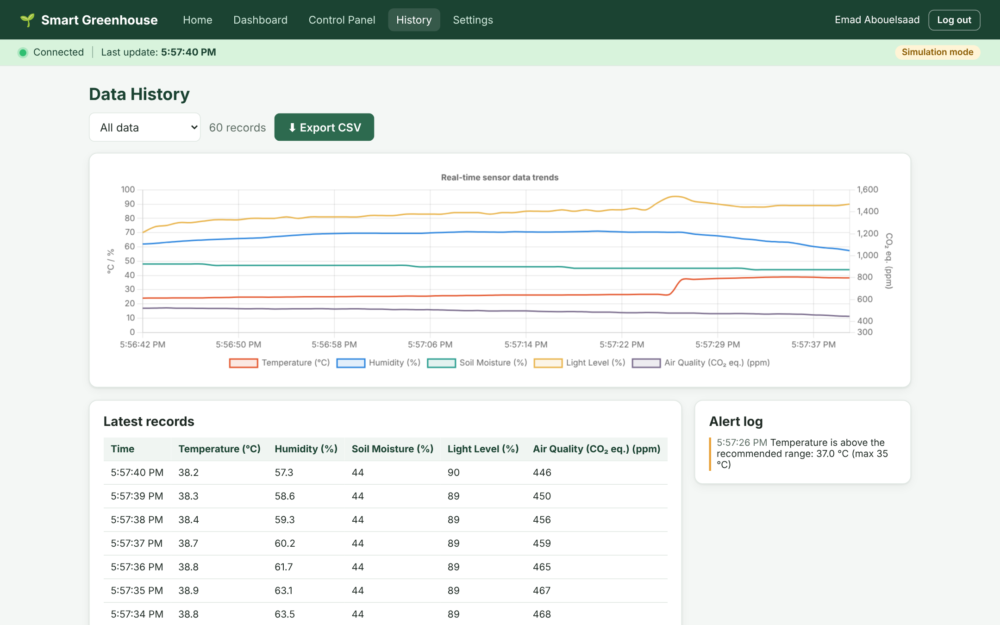
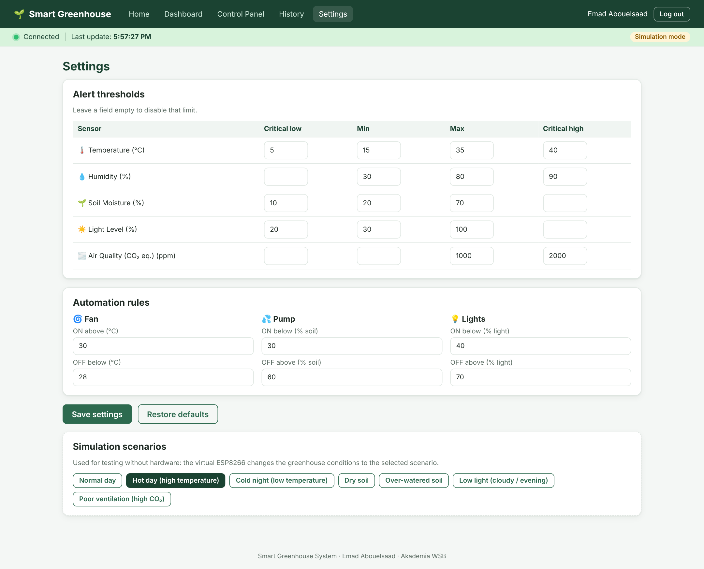

# 🌱 Smart Greenhouse System

IoT-based monitoring and control system for greenhouses, developed as the practical part of my bachelor thesis
**"A Smart Green House System"** (Mobile and Cloud Computing, Akademia WSB, supervisor: Dr inż. Tomasz Siemek).

The system measures **temperature, humidity, soil moisture, light and air quality**, stores the data in the cloud and
lets the user monitor the greenhouse and control the **ventilation fan, water pump and LED grow lights** from a web
browser – manually or automatically.



---

## Architecture



| Layer | Technology | Folder |
|---|---|---|
| Sensor node | NodeMCU ESP8266, Arduino C++ | [`firmware/`](firmware) |
| Cloud backend | Firebase Realtime Database, Authentication, Cloud Functions (Node.js 20) | [`functions/`](functions), [`database.rules.json`](database.rules.json) |
| Web application | React 18, Vite, Chart.js, Firebase JS SDK | [`dashboard/`](dashboard) |
| Simulation & data tools | Python 3 (virtual ESP8266, greenhouse model, CSV export) | [`simulator/`](simulator) |
| Deployment | Firebase Hosting or Docker (nginx) | [`firebase.json`](firebase.json), [`dashboard/Dockerfile`](dashboard/Dockerfile) |

More details: [docs/architecture.md](docs/architecture.md) · [docs/hardware.md](docs/hardware.md) ·
[docs/setup.md](docs/setup.md) · [docs/testing.md](docs/testing.md)

## Features

- **Real-time monitoring** of five environmental parameters with automatic updates every 5 seconds
- **Live chart** of the latest readings and a **history page** with **CSV export**
- **Alerts** (warning / critical) with thresholds that the user can change on the Settings page
- **Manual control** of the fan, pump and lights; every command is removed after 30 s so old commands are never re-applied
- **Automatic mode** with hysteresis rules, executed on the ESP8266 so it also works without internet
- **Safety rule**: the pump never runs longer than 60 seconds, and after a safety stop the automatic mode cannot
  restart it for 10 minutes (protects against an empty tank or a broken soil sensor)
- **User accounts** with Firebase Authentication (sign up, log in, password reset, protected pages); new accounts
  get access to the greenhouse only after the administrator approves them
- **Responsive design** – works on computers, tablets and smartphones
- **Simulation mode** – the whole system runs without hardware and without a Firebase project, using a physical
  greenhouse model (day/night cycle, reaction to the actuators) and test scenarios (hot day, dry soil, low light…)

## Quick start (simulation mode – no hardware needed)

```bash
cd dashboard
npm install
npm run dev
```

Open <http://localhost:5173> and log in with the demo account `demo@greenhouse.local` / `Demo1234`
(or create a new account). In **Settings → Simulation scenarios** you can change the greenhouse conditions.

To connect a real Firebase project, copy `dashboard/.env.example` to `dashboard/.env` and fill in the values.
See [docs/setup.md](docs/setup.md) for the complete guide (Firebase, firmware, deployment).

## Tests

| Part | Command | Result |
|---|---|---|
| Dashboard logic & simulation (Vitest) | `cd dashboard && npm test` | 30 tests passed |
| End-to-end test cases TC-01 … TC-13 (Playwright) | `cd dashboard && npx playwright test` | 26 tests passed |
| Cloud Functions alert rules | `cd functions && npm test` | 3 tests passed |
| Python greenhouse model & simulator | `cd simulator && pytest -q` | 6 tests passed |
| Firmware build | `arduino-cli compile --fqbn esp8266:esp8266:nodemcuv2` | compiles |

The tests and the firmware build run automatically on GitHub Actions ([`.github/workflows/ci.yml`](.github/workflows/ci.yml)).

## Screenshots

| Login | Home | Control panel |
|---|---|---|
|  |  |  |
| **Alerts** | **History & export** | **Settings** |
|  |  |  |

## Database structure

```text
esp8266/
  temperature, humidity, soilMoisture, lightLevel, airQuality, lastUpdate
  fan/   control ("ON"|"OFF", removed after 30 s), status ("ON"|"OFF")
  pump/  control, status
  light/ control, status
settings/   autoMode, thresholds/…, automation/…
allowedUsers/ <uid>: true   (approved accounts, added by the administrator in the Firebase console)
history/    <pushId>: { timestamp, temperature, humidity, … }   (written by Cloud Functions)
alerts/     active: […], log/<pushId>: { sensor, level, message, timestamp }
```

## Author

**Emad Abouelsaad** – Akademia WSB, Mobile and Cloud Computing
Supervisor: Dr inż. Tomasz Siemek

Licensed under the [MIT License](LICENSE).
