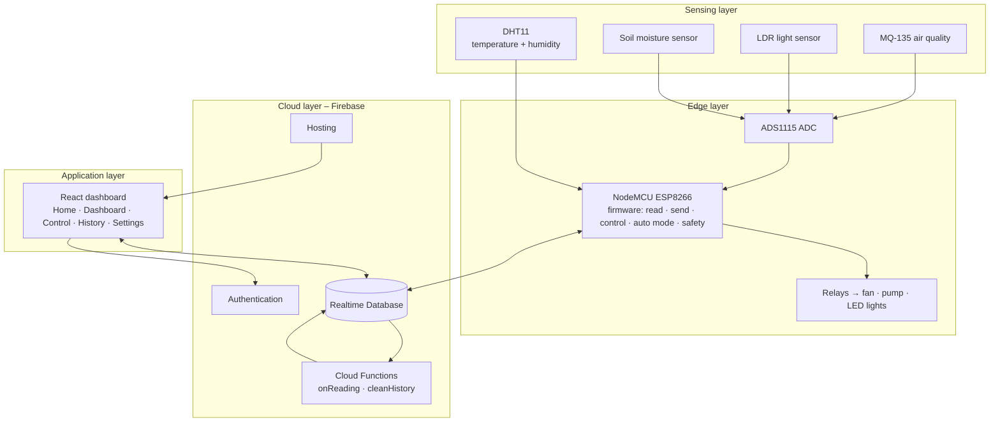
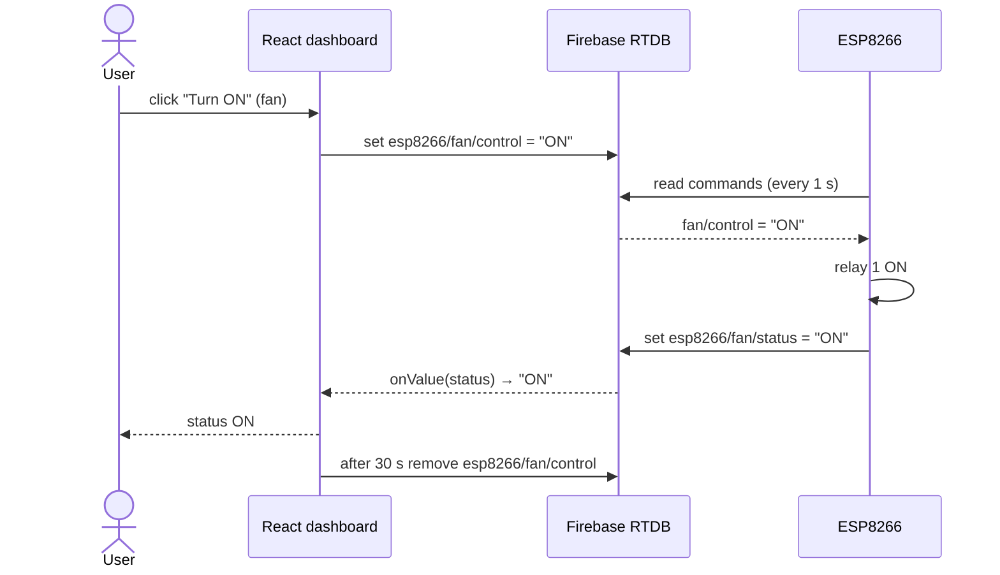

# System architecture

The system consists of three main parts: the **sensor node** (sensing and edge control on the ESP8266), the **cloud** (Firebase) and the **web application**. The diagram below shows the node split into its sensing and edge-control layers.

## Data flow

1. Every **5 seconds** the ESP8266 reads the sensors and updates `/esp8266` with the readings and a server timestamp.
2. The Cloud Function **`onReading`** is triggered by the new timestamp. It copies the reading to `/history` and
   compares it with the thresholds (`/settings/thresholds`). Active alerts are written to `/alerts/active` and new
   alerts to `/alerts/log`.
3. The dashboard uses **real-time listeners** (`onValue`) on `/esp8266`, `/history` and `/alerts`, so the screen is
   updated as soon as the data changes, without reloading the page.
4. When the user presses a button, the dashboard writes `"ON"` or `"OFF"` to `/esp8266/<device>/control` and removes
   the command after 30 seconds. The ESP8266 executes new commands and confirms them in `/esp8266/<device>/status`.
5. When **automatic mode** is enabled (`/settings/autoMode`), the ESP8266 applies the control rules itself.

## Sequence: user switches on the fan

## Security

- The data can be read and written only by signed-in accounts listed in `/allowedUsers` (approved by the administrator);
  anyone can sign up, but a new account sees no data until it is approved. See [`database.rules.json`](../database.rules.json).
- The readings of the node are validated (type and range); commands accept only `"ON"` or `"OFF"`.
- `/history` and `/alerts` can only be written by Cloud Functions (Admin SDK).
- The ESP8266 signs in with its own Firebase user account; Wi-Fi and Firebase secrets are kept in `config.h`, which
  is not stored in git.
- All communication uses HTTPS/TLS.

## Simulation mode

The dashboard contains an in-memory implementation of the same database API (`MemoryDatabase`), a simulated
authentication service (`MemoryAuth`), a virtual ESP8266 (`VirtualDevice`) and a browser copy of the Cloud Functions
logic (`CloudLogic`). The virtual ESP8266 uses a physical model of the greenhouse (`GreenhouseModel`): the
temperature follows the outside temperature and the solar gain, the fan cools the air and removes CO₂, the pump
increases soil moisture and the LEDs add light. The Python simulator in `/simulator` uses the same model and can send
data to a real Firebase project or to the Firebase Emulator.
